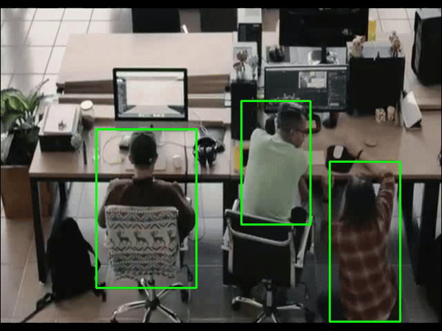

 <h1 align="center">Staff Tracking YOLO </h1>

Dowload yolo to your device: https://github.com/ultralytics/yolov5

## How to run
Run` pip install -r requirements.txt` in terminal
Open test.py
Change the video path
Run `python test.py`

## Demo

   
  <i>Demo</i>

## Requirements

* **python**
* **opencv**
* **YOLO**

